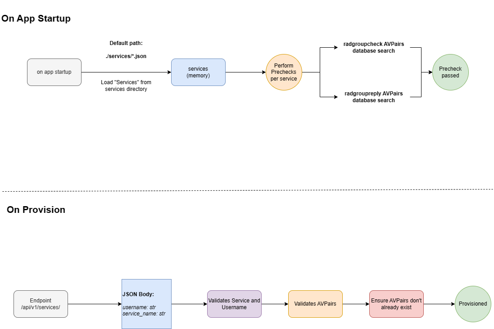

# Services Policy Engine

A specific feature in the freeradius-api project allows us to create services in JSON files and define parameters like Radius AVPairs that should be added to the freeradius database upon creating a user that references this service. For example instead of creating a brand new FastAPI endpoint and having to write Python for a new speed package, you can simply create a new JSON file with a unique service name and ensure that users created against the `/api/v1/services/` endpoint with a reference to the relevant service will be added to the relevant radusergroup table and also user specific attributes like radcheck and radreply avpairs.

---

## Policy Logic/Workflow

The current workflow can be described below:



### On App Startup

1. Services are loaded from the configured directory (specifically any file with the .json suffix)
2. Depending on if a single service or multiple services are configured in the single JSON file, they are attempted to load into the service pydantic model for a pre-validation check
3. If the service passes the validation check, it is currently assigned in memory to the services (this will later be moved to redis to share across multiple instances)
4. Each service will now run through logic to confirm if there is any duplicate services with the same "service_name" and that any related AVPairs to `radgroupcheck` and `radgroupreply` are created in the database already. If they are not then the precheck will fail and the endpoint will throw an error if you attempt to create a user with this service until the attributes are in the database

---

### On Provision

1. Basic valdiation is performed to check the JSON body, ensuring the provided `service_name` is configured already and has passed its prechecks
2. Username validation will process the service templates defined `username_type`, by default this is `str`.
3. Any special variables such as `{{username}}` and `{{service_name}}` populated in the template will be replaced to create the initial service model
4. Service User check is now performed to ensure that any `radcheck` and `radreply` specific user attributes don't already exist in the database.
5. Now the user is created with the relevant AVPairs and Groups defined in the Service Template and the user has been provisioned

## Service Template

A service template is just a JSON file that allows you to create a service without writing Python. This is extremely powerful because you can now create a range of services and ensure users that reference the service in the provisioning process will be created with the relevant group assosications, AVPairs and even perform username validiation to adhere to your service (eg. enforcing the username to be a regex string or a mac address)

Example services can be found [in this directory](https://github.com/BSpendlove/freeradius-api/tree/main/services).

---

### Service Variables

| Variable Name      | Description |
| ----------- | ----------- |
| service_name | Unique Name for the service to reference during provisioning process |
| username_type   | Used to compare username, valid types are "str &#124; int &#124; uuid &#124; mac_address &#124; regex" |
| username_regex | Regex String to use if username_type is set to `regex` |
| radusergroups | List of RadUserGroup that the user is apart of |
| radcheck_avpairs | AVPairs that will be added into the radcheck table for this user during provisioning process |
| radreply_avpairs | AVPairs that list be added into the radreply table for this user during provisioning process |
| radgroupcheck_avpairs | AVPairs that should already be present in the radgroupcheck database table for the relevant group to pass the app startup prechecks |
| radgroupreply_avpairs | AVPairs that should already be present in the radgroupreply database table for the relevant group to pass the app startup prechecks |

---

### Special Variables

The following variables can be used so that the policy endpoint will automatically populate these fields during the user prechecks and provisioning process:

| Variable Name      | Description |
| ----------- | ----------- |
| {{service_name}} | Takes the configured `service_name` of the service |
| {{username}} | Takes the `username` that was supplied in the body of the provisioning request |

---

### Formatting AVPairs

`radcheck_avpairs` and `radreply_avpairs`
| Variable Name      | Description |
| ----------- | ----------- |
| username | The name of the user to apply the AVPair to, preferably use `{{username}}` for template to fill this variable out for you automatically |
| attribute | IETF Attribute or Vendor Specific Attribute |
| op | Operation "= &#124; += &#124; :=" |
| value |  Value of the Attribute to set |

`radgroupcheck_avpairs` and `radgroupreply_avpairs`
| Variable Name      | Description |
| ----------- | ----------- |
| groupname | The name of the group to check AVPairs, preferably use `{{service_name}}` for template to fill this variable out for you automatically |
| attribute | IETF Attribute or Vendor Specific Attribute |
| op | Operation "= &#124; += &#124; :=" |
| value |  Value of the Attribute to set |

---

Below is an example of a service that matches usernames based on MAC Addresses, adds a user to a group called `VLAN_100_SERVICE` and creates a radcheck and radreply attribute to the FreeRADIUS database.

```
{
    "service_name": "VLAN_100_SERVICE",
    "username_type": "mac_address",
    "radusergroups": [
        {
            "username": "{{username}}",
            "groupname": "{{service_name}}",
            "priority": 100
        }
    ],
    "radcheck_avpairs": [
        {
            "username": "{{username}}",
            "attribute": "ClearText-Password",
            "op": ":=",
            "value": "{{username}}"
        }
    ],
    "radreply_avpairs": [
        {
            "username": "{{username}}",
            "attribute": "Framed-Pool",
            "op": "=",
            "value": "VLAN_100_POOL"
        }
    ],
    "radgroupcheck_avpairs": [
        {
            "groupname": "{{service_name}}",
            "attribute": "ClearText-Password",
            "op": "=",
            "value": "default"
        }
    ],
    "radgroupreply_avpairs": [
        {
            "groupname": "{{service_name}}",
            "attribute": "Tunnel-Type",
            "op": ":=",
            "value": 13
        },
        {
            "groupname": "{{service_name}}",
            "attribute": "Tunnel-Medium-Type",
            "op": ":=",
            "value": 6
        },
        {
            "groupname": "{{service_name}}",
            "attribute": "Tunnel-Private-Group-Id",
            "op": ":=",
            "value": 100
        },
        {
            "groupname": "{{service_name}}",
            "attribute": "Fall-Through",
            "op": "=",
            "value": "Yes"
        }
    ]
}
```

## Cisco-AVPairs

Cisco AVPairs are a vendor specific attribute which extends the value field to include sub attributes like this:

Cisco-AVPair += '`delegated-prefix=2001:db8::/48`'

If you enable the `VALIDATE_AVPAIRS` option in the configuration of this API, then the user precheck performed during the provisioning process will attempt to decode this sub-attribute in the format of '`<attribute> <op> <value>`' and perform basic validation against the FreeRADIUS dictionary of attributes. The idea of this is that you provide the API the same dictionary files loaded on the FreeRADIUS server which is used to search, if the sub attribute does not exist then an error is simply thrown because adding an attribute into the database that FreeRADIUS doesn't know how to build is unnecessary information in the database.